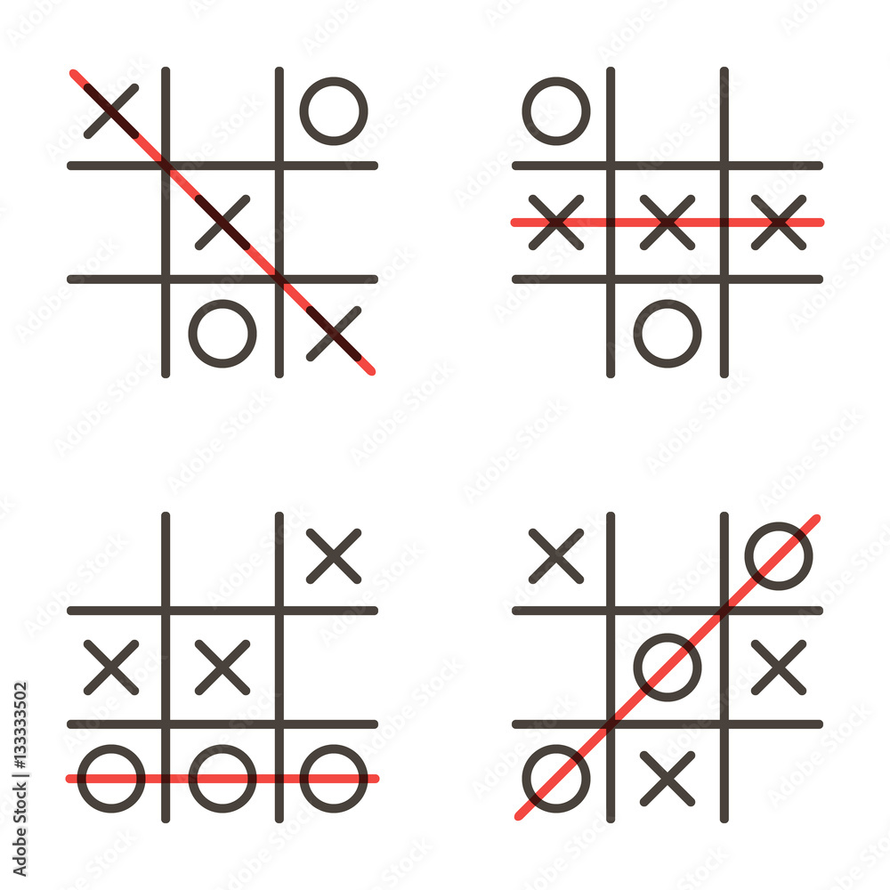

# Frontend Engineer Assessment - Tic Tac Toe

Build a classic Tic Tac Toe game with the following stack:

- React / React Native (if you are applying for Mobile role please use RN)
      - Use Create React App (CRA) / Create React Native App (CRNA) as template
- Redux (optional)
- Unit test (optional)
- Styled-components (optional)
- UI Libraries (optional)

The image above act only as an example, it is not necessary to look exactly like it.

Along with the submission would be great if you can provide your profiles of the following if applicable for our reference, it will help us tremendously to get to know you better.

- Github
- Code snippets/repo eg. codesandbox, codepen etc
- Coding challenges/certification sites eg. HackerRank, HackerEarth etc

## Submission requirements

- Please clearly state extra build and run requirements if any
- Please share the assignment via a PRIVATE git repository
- We want to observe your commit messages and the process, please commit module by module, instead of committing at one shot
- Please add users as stated in the email as collaborators
