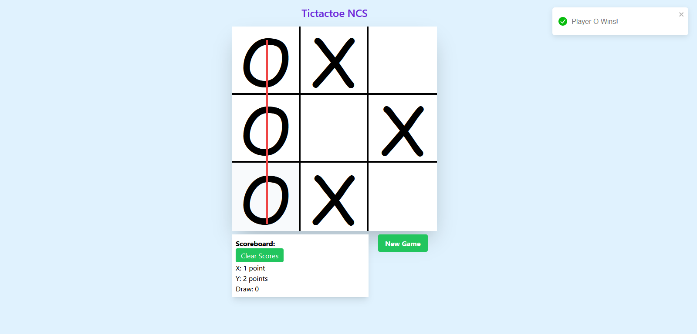
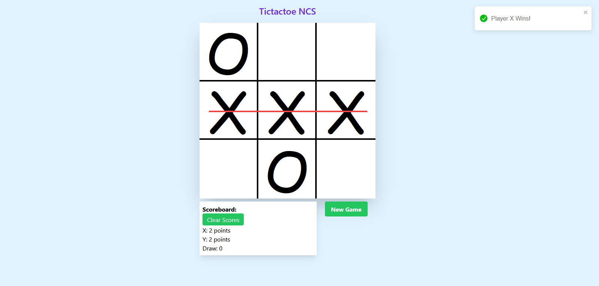
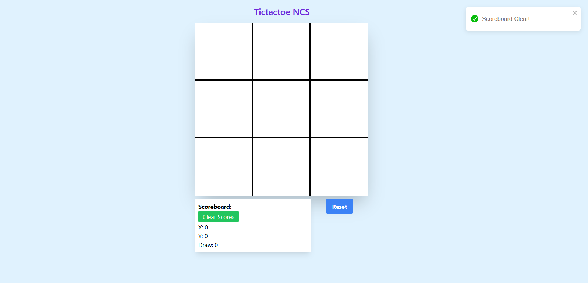

For running the app needs to install packages first use the following code in the terminal

### npm install

then once the packages installed you can now run the app using

### npm start

this codes/algorthm is originally made by me Mark Jomel Mallari
Technical Stacks I used are just pure ReactJS and Tailwind CSS

-ReactJs
-TailwindCSS
-React/ReduxToolKit
-React-Toastify

# Example Initial Page

# Game Mechanics

first player who can plot 3 slot with pattern wins
sample winning patterns

# Game Reset and New Game

## Submission requirements

- Please clearly state extra build and run requirements if any
- Please share the assignment via a PRIVATE git repository
- We want to observe your commit messages and the process, please commit module by module, instead of committing at one shot
- Please add users as stated in the email as collaborators
